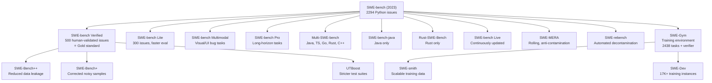

# Evaluation Landscape

A structural view of the SE agent evaluation field — where coverage is dense, where it's thin, and where the gaps are.

Data source: `data/stats.json` (425 resources, updated 2026-04-29)

---

## Coverage Map

Which SE dimensions have strong benchmark coverage vs. which are underserved.

| Dimension | Coverage | Count | Status |
|---|---|---|---|
| End-to-End / Multi-Task | `████████████` | 60 | Well-covered |
| Bug Fix & Issue Resolution | `██████████` | 40 | Well-covered |
| Code Generation | `████████` | 33 | Well-covered |
| Security & Vulnerability | `██████` | 23 | Growing |
| Testing & QA | `██████` | 22 | Growing |
| Code Review | `█████` | 18 | Growing |
| Process Evaluation | `████` | 17 | Emerging |
| Long-Horizon / Evolution | `███` | 13 | Emerging |
| Large Codebase / Multi-Repo | `██` | 7 | Sparse |
| Production-Derived | `██` | 6 | Sparse |
| Multi-Agent | `█` | 5 | Gap |
| Requirements Understanding | `` | 0 | Gap |
| Architecture Decisions | `` | 0 | Gap |

**Takeaway**: Bug fixing and end-to-end tasks are saturated. Requirements understanding and architecture decisions have zero dedicated benchmarks — these are the frontier.

---

## Resource Type Breakdown

| Type | Count | Share |
|---|---|---|
| Papers | 262 | 62% |
| Repos | 56 | 13% |
| Tools | 54 | 13% |
| Paper + Repo | 37 | 9% |
| Blogs | 11 | 3% |
| Leaderboards | 5 | 1% |

Most resources are academic papers. Practitioner tooling (repos + tools) accounts for ~26%.

---

## SWE-bench Family Tree



**Core insight**: SWE-bench Verified is the de facto standard. The family has branched in three directions — multi-language coverage, contamination resistance, and training data generation.

---

## Methodology Evolution Timeline

```
2021  HumanEval
      └─ Execution-based, function-level, isolated problems
         First rigorous code generation benchmark

2022  MBPP, DS-1000
      └─ Broader function-level coverage, data science tasks

2023  SWE-bench
      └─ Execution-based, repository-level, real GitHub issues
         Paradigm shift: from toy problems to real engineering tasks

2024  SWE-bench Verified, Multi-SWE-bench
      └─ Human validation, multi-language expansion
         LLM-as-Judge methods emerge for non-executable tasks
         Code review benchmarks appear (CR-Bench, CRScore)

2025  Process evaluation emerges
      └─ Trajectory-level scoring, not just final outcomes
         SWE-bench Pro (long-horizon), SWT-Bench (testing focus)
         Production-derived benchmarks (AIDev 930K PRs)
         Contamination-resistant variants (LiveCodeBench, SWE-MERA)

2026  Hybrid + production-derived benchmarks
      └─ Execution + LLM judge combined
         Agent-as-a-Judge (agents evaluating agents)
         Real-world merge rate studies (METR: ~50% wouldn't merge)
         Gap identified: requirements understanding, architecture
```

---

## Evaluation Method Distribution

Of the 228 benchmarks with a documented eval method:

| Method | Count | Notes |
|---|---|---|
| Execution-based | 16 | Most reliable; requires runnable environment |
| LLM-as-Judge | 1 | Growing fast; bias risks documented |
| Hybrid | 1 | Best signal; higher setup cost |
| Not specified | ~210 | Many papers describe method inline, not as a field |

The low explicit counts reflect a data gap, not actual usage — execution-based is the dominant approach in practice.

---

## Language Coverage

| Language | Resources |
|---|---|
| Python | 89 |
| TypeScript | 13 |
| Go | 9 |
| Rust | 8 |
| Java | 7 |
| JavaScript | 5 |
| Others | 10 |

Python dominates. Multi-language benchmarks (Multi-SWE-bench, OmniGIRL) are the main path to broader coverage.

---

## Key Gaps Summary

1. **Requirements Understanding** — No benchmark tests whether an agent can go from vague requirements to a correct implementation plan.
2. **Architecture Decisions** — No benchmark evaluates design choice quality (e.g., choosing between two valid approaches).
3. **Multi-Agent Collaboration** — Only 5 resources cover multi-agent SE systems; none are widely adopted.
4. **Long-Horizon Continuity** — SWE-bench Pro and SWE-EVO exist but are not yet widely used.
5. **Production Validity** — METR's finding that ~50% of passing PRs wouldn't merge shows a gap between benchmark scores and real-world quality.

---

[← Back to README](../README.md)
